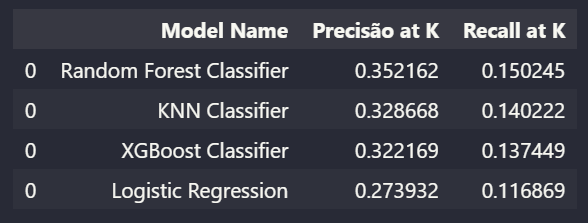

# Venda Cruzada de Seguro de Carros e Saúde

Este projeto apresenta uma seguradora que vende seguros de saúde e agora busca prever o interesse dos segurados em seu novo produto de seguro veicular. O Objetivo deste modelo é para direcionar estratégias de comunicação e maximizar a receita, identificando os clientes mais propensos à aquisição deste novo seguro.

# 1. Problema de Negócio

A empresa contratante, experiente em seguros de saúde, conduziu uma pesquisa que revelou o interesse de cerca de 381 mil clientes no novo seguro veicular. Contudo, há outros 127 mil clientes que não responderam à pesquisa. O objetivo é criar uma lista classificada pela probabilidade de interesse desses clientes no seguro de veículo, visando otimizar a conversão e o faturamento da empresa.

# 2. Premissas de Negócio

Cada linha da tabela representa um cliente e as colunas descrevem seus atributos, incluindo sua resposta à pesquisa sobre o interesse no novo produto de seguros.

Variável | Definição
------------ | -------------
|Id| Identificador único do cliente.|
|Gender| Gênero do cliente.|
|Age| Idade do cliente.|
|Driving License| 0, o cliente sem habilitação e 1, o cliente com habilitação |
|Region Code| Código da região do cliente.|
|Previously Insured| 0, o cliente sem seguro de automóvel e 1, o cliente com seguro de automóvel.|
|Vehicle Age| Idade do veículo.|
|Vehicle Damage| 0, cliente que nunca teve seu veículo danificado no passado e 1, cliente já teve seu veículo danificado no passado.|
|Anual Premium| Valor do custo do cliente pelo seguro de saúde anual.|
|Policy sales channel| código do canal de contato com o cliente.|
|Vintage| número de dias que o cliente se associou à empresa através da compra do seguro de saúde.|
|Response| 0, o cliente não tem interesse e 1, o cliente tem interesse.|

# 3. Estratégia de Solução

Coleta de Dados: Obter os dados necessários das tabelas do banco de dados da empresa.

Limpeza dos Dados: Remover inconsistências nos dados que possam prejudicar a performance dos algoritmos de Machine Learning.

Exploração dos Dados: Analisar as relações entre os dados, gerando hipóteses acionáveis e novas características.

Modelagem dos Dados: Preparar os dados para uso em algoritmos de Machine Learning, realizando transformações e codificações.

Seleção de variaveis: Escolha das variáveis mais importantes para o treinamento do modelo de aprendizado de maquina.

Aplicação de Algoritmos de Machine Learning: Selecionar e aplicar algoritmos nos dados preparados, comparando sua eficácia.

Avaliação de Performance: Avaliar a performance do algoritmo escolhido em relação aos resultados atuais e traduzir em ganhos financeiros.

Publicação da Solução: Tornar a solução disponível e utilizável ao publicar o algoritmo selecionado.

## 3.1 Ferramentas Utilizadas
Neste projeto foram utilizadas as seguintes ferramentas nesta solução:

- Linguagem Python versão 3.12
- Vscode para prototipação
- Git e Github para versionamento de código
- Manipulação e visualização de dados em linguagem Python
- Algoritmos de Classificação com as biblioteca Scikit-Learn e XGBoost

## 3.2 Modelos de Machine Learning Aplicados

No primeiro ciclo do projeto, foram testados quatro algoritmos para escolher o melhor em termos de desempenho e custo de implementação.

- KNN Classifier
- Linear Regression
- Random Forest Classifier
- XGBoost Classifier

Segue abaixo o desempenho apresentado:

Apesar dos resultados encontrados nesta análise foi decidido seuir com o modelo de XGBoost Classifier devido aos valores apresentados no fine tunning:

# 4. Produto Final

Para o produto final, foi desenvolvido uma planilha no Google Sheets com dados dos clientes sendo possível acessar o modelo por meio da API e obter informaçoes em porcentagem de chanches que cada cliente possa ter interesse em adquirir o seguro automotivo usando uma aplicação desenvolvida no Apps Script.

Essa aplicação gera uma lista de clientes com seu índice de propensão de compra, classificando-os de acordo com os clientes mais propensos no topo da lista.

Acesse esta planilha neste [link](https://docs.google.com/spreadsheets/d/1nPtFNaulvtganpiat6vAZkgk6nFXjt5yUrU9ue76TNk/edit?usp=sharing)

